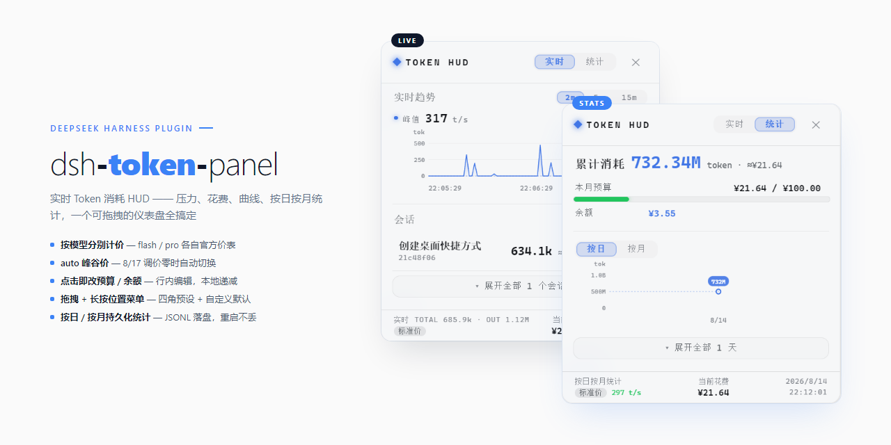

<div align="center">

# dsh-token-panel

[](LICENSE)
[](https://github.com/juhe291/dsh-token-panel/releases)
[](https://github.com/juhe291/dsh-token-panel)
[](https://github.com/topics/dsh-plugin)

**Real-time token consumption HUD for [DeepSeek Harness](https://github.com/deepseek-ai/deepseek-harness) — live session pressure, per-session cost, history curves, and per-day/per-month statistics, in a draggable corner dashboard that follows your current conversation.**

🌐 [**中文**](README.md) ｜ **English**

</div>

## ✨ Highlights

| 💰 **Per-model pricing** | flash / pro each billed at official rates — sessions that switch models stay accurate |
|---|---|
| ⏱️ **Auto peak/off-peak** | switches to peak/off-peak pricing **automatically** at the 2026-08-17 revision — no config change |
| ✏️ **Click-to-edit budget / balance** | inline editing in the stats view; balance decreases locally with token consumption |
| 🖱️ **Drag + long-press menu** | four corner presets + custom default position, remembered across reloads |
| 📊 **Durable daily / monthly stats** | JSONL logs on disk, survive restarts, get richer over time |

<p align="center">
  
</p>

> 📷 The two panels in the cover are **real UI screenshots** (left: live view; right: stats view).

---

## Installation

### From GitHub

```sh
dsh plugin --profile web add github:juhe291/dsh-token-panel
```

### From a local path

```sh
dsh plugin --profile web add C:\path\to\dsh-token-panel
```

**Restart the profile**, then refresh the browser — the TOKEN pill appears bottom-right.

> ⚠️ **pnpm ≥ 10 blocks Git build scripts**: if the first install fails with `ERR_PNPM_GIT_DEP_PREPARE_NOT_ALLOWED`, add the `allowBuilds` entry printed in the error to the `pnpm-workspace.yaml` in your profile directory, then re-run the install command. This package ships a `prepare` build script **and** committed `lib/` artifacts, so it works with or without allowlisted builds.

---

## Usage

### Panel interactions (three gestures, zero conflicts)

1. **Click the pill** to open the panel (pill shows pressure + ≈cumulative + TPS)
2. **Drag** the pill or the panel header to move — you may drag the panel **past the screen edges** (any side), but a grabbable header strip always stays visible; the position is remembered across reloads
3. **Long-press 0.6s** (pill or panel header) opens the position menu:

```
┌──────────────────────┐
│ ⌟ Bottom-right        │ ← icon/text follow the saved default
│ ✛ Position ▸          │
│ Cancel                │
└──────────────────────┘
   Position submenu:
   ├ ⌜ Top-left / ⌝ Top-right / ⌞ Bottom-left / ⌟ Bottom-right  ← presets
   └ ✛ Custom position…                                         ← drag & release to save
```

- **Back to default**: the first item's icon and label follow the saved default ("Back to default · Top-right", "Back to custom position")
- **Corner presets**: click to move there AND save as the default (uses the actual panel size, so bottom corners truly touch the edge)
- **Custom position**: choose it, then drag the panel anywhere and release — saved as the new default, used on every page load
- **✕** closes the panel without moving it (use the long-press menu to reset)

### Live view

- Session rows: **bold number = current context pressure** (k scale); grey `≈` = cumulative usage (M scale, incl. cache reads); **green `¥` = that session's estimated cost** (priced by the model the session actually used)
- Click a row for details (input / output / cache read / cache write, pressure / projected / capacity, cost, context-usage bar) and its consumption curve
- Curves: **auto-scaling Y axis** (1/2/2.5/5×10ⁿ rounding with hysteresis, zero when idle, unit label always visible) + gridlines + a dashed leader with a floating value pill at the latest point + time ticks on X
- Peak consumption rate (t/s) above the curve; 2m / 5m / 15m window switching
- The panel follows the conversation you are viewing; "Show all" reveals historic sessions (survive restarts)

### Stats view

- **Cumulative consumption** headline in one line (total tokens + ≈¥ cost)
- **Editable budget / balance**: click a value to edit inline (Enter to save / Esc to cancel); the balance decreases locally with token consumption (persists across reloads), falling back to the API-fetched official balance when unset
- **Daily / Monthly** switch: trend curve + detail list (collapsed by default, "Expand all" to see everything)
- Usage is persisted per day (JSONL) and survives restarts

---

## Overview

A compact pill in the bottom-right corner shows the total token pressure in real time. Click it to expand a dashboard with two switchable views — **Live** and **Stats** — styled with DSH design tokens (auto light/dark adaptation). The panel **follows your current conversation**: when you open a different chat, the panel shows that session; empty and historic sessions stay hidden behind a "Show all" toggle.

### 🟢 Live View

| Feature | Description |
|---|---|
| Session list | One row per session: **title + current context pressure + cumulative usage + session cost**; titles come from the DSH session-title service |
| Session details | Click a row: input / output / cache-read / cache-write, pressure / projected / capacity, estimated cost, context-usage progress bar (turns red above 85%) |
| Live curves | Per-session SVG area chart with auto-scaling Y axis (1/2/2.5/5×10ⁿ rounding + hysteresis, zero when idle, unit label always visible), gridlines, dashed leader with floating value pill, and **2m / 5m / 15m** range switching |
| Peak rate | Peak consumption rate (t/s) shown above the curve |
| Follows current session | Only the open conversation is shown by default; historic sessions collapse behind "Show all" (survive restarts) |
| Empty-session filter | Fresh conversations with 0 tokens are hidden entirely |
| TPS | Generation speed (t/s) shown on the pill and the footer |

### 📊 Stats View

| Feature | Description |
|---|---|
| Daily / Monthly | Independent switch: trend curve + detail list (collapsed by default, "Expand all" to see every day / month) |
| Trend curves | SVG curves over days / months with M/D date ticks and Y-axis labels |
| Cumulative total | One-line headline: total tokens consumed plus the ≈¥ estimated cost |
| Budget & balance | **Click values to edit inline** (Enter saves / Esc cancels); budget shows used-this-month / total with a progress bar (red over budget); balance decreases locally with token consumption, falling back to the API-fetched official balance when unset |
| Durable | Usage is written to per-day JSONL logs on disk — **survives restarts** |

> ⚠️ **Number scale note**: the stats view's "Daily / Monthly" figures are **cumulative historical consumption** (input + output + **cache reads** summed); cache reads usually dominate, so a single day can reach hundreds of millions of tokens (displayed with the M suffix). The live view, by contrast, shows **current context pressure** (tokens in context right now, typically tens of thousands — k suffix). **These are two different quantities**; seeing "live 400k / stats 100M" is expected, not a bug. The `≈` number on a session row is that session's cumulative consumption, and the `¥` figure is its estimated cost — both matching the stats-view scale.

### 💰 Cost Estimation

- **Per-model pricing**: built-in tables for `deepseek-v4-flash` and `deepseek-v4-pro` (cache hit / uncached input / output billed separately); sessions and stats are priced by the model each session actually used, so a session that switched models is never billed entirely at one rate
- **auto price mode** (default): uses the flat legacy rates until 2026-08-17 00:00 Beijing time, then automatically switches to DeepSeek's official peak/off-peak schedule (peak 9-12 & 14-18); the footer badge shows "flat rate / peak rate / off-peak rate" accordingly — no config change needed
- Display-only estimates — the provider dashboard is authoritative.

---

## Configuration

In your profile's `cordis.patch.yml` (or the plugin section of `settings.yaml`):

```yaml
- id: token-panel
  name: dsh-token-panel
  config:
    pollInterval: 1500          # live poll interval (ms)
    priceMode: auto             # auto = flat until 2026-08-17, then peak-offpeak automatically; flat / peak-offpeak to pin
    # Global fallback prices (models not listed in modelPrices; defaults = flash rates)
    pricePerMInput: 1           # uncached input price (CNY / 1M tokens)
    pricePerMCacheRead: 0.02    # cache-hit price (CNY / 1M tokens)
    pricePerMOutput: 2          # output price (CNY / 1M tokens)
    # Peak / off-peak fallback (when peak-offpeak is active)
    pricePeakInput: 3           # peak uncached input
    pricePeakCacheRead: 0.1     # peak cache-hit
    pricePeakOutput: 9          # peak output
    priceOffpeakInput: 1.5      # off-peak uncached input
    priceOffpeakCacheRead: 0.05 # off-peak cache-hit
    priceOffpeakOutput: 4.5     # off-peak output
    # Per-model price tables (CNY / 1M tokens): sessions and stats bill by the model actually used
    modelPrices:
      deepseek-v4-flash:
        flat:    { hit: 0.02,  miss: 1,   output: 2 }
        peak:    { hit: 0.10,  miss: 3,   output: 9 }
        offpeak: { hit: 0.05,  miss: 1.5, output: 4.5 }
      deepseek-v4-pro:
        flat:    { hit: 0.025, miss: 3,   output: 6 }
        peak:    { hit: 0.30,  miss: 9,   output: 27 }
        offpeak: { hit: 0.15,  miss: 4.5, output: 13.5 }
    budgetMonthly: 0            # monthly budget (CNY); 0 disables (or click the value in the stats view to set it)
    # dataDir: ~/.dsh/cache/dsh-token-panel   # durable log directory (optional)
```

| Key | Default | Description |
|---|---|---|
| `pollInterval` | `1500` | Browser live-poll interval (ms) |
| `priceMode` | `auto` | Pricing mode: `auto` switches from flat to peak/off-peak automatically at 2026-08-17 00:00 Beijing time; `flat` / `peak-offpeak` pin a mode |
| `pricePerM*` | `1 / 0.02 / 2` | Global fallback prices per 1M tokens (CNY, display only) |
| `pricePeak*` | `3 / 0.1 / 9` | Peak-period fallback prices (Beijing 9-12, 14-18) |
| `priceOffpeak*` | `1.5 / 0.05 / 4.5` | Off-peak fallback prices |
| `modelPrices` | built-in flash + pro | Per-model price tables (flat / peak / off-peak tiers); override or add models |
| `budgetMonthly` | `0` | Monthly budget (CNY); >0 shows a budget bar, or click the value in the stats view to set it directly |
| `dataDir` | `~/.dsh/cache/dsh-token-panel` | Durable usage-log directory |

> Built-in defaults match the official DeepSeek tables (flat legacy rates before 2026-08-17, peak/off-peak after). Adjust `modelPrices` for other models/providers.

---

## Data Storage

Usage logs are appended per day (one JSON delta per line):

```
~/.dsh/cache/dsh-token-panel/
├── usage-2026-08-14.jsonl   # daily usage logs (deltas: input/output/cache read/cache write/model)
├── state.json               # last-seen baselines (resume across restarts)
└── known-sessions.json      # session registry ("Show all" survives restarts)
```

Tracked buckets: uncached input, output, cache read, cache write, **model** (deltas). The first observation of a session writes a full baseline, then deltas follow — totals start from the true baseline and never double-count after a restart.

---

## How It Works

- **Host side** (`src/index.ts`):
  - Aggregates `ctx.tokenMeter.measure()` (pressure/surface), `ctx.sessionProjections.snapshot()` (provider usage/capacity/breakdown), `ctx.sessionTitle.get()` (titles) and `ctx.credentials.resolve('DEEPSEEK_API_KEY')` (official balance)
  - Serves three HTTP routes: `/plugins/dsh-token-panel/snapshot` (live + per-model price tables), `/plugins/dsh-token-panel/stats` (durable stats), `/plugins/dsh-token-panel/balance` (official balance, 5-min cache)
  - Persists usage deltas per day (crash-safe: tmp + atomic rename), accumulated per session × model for per-model cost pricing
  - Filters out empty sessions (0 tokens)
- **Client side** (`src/client/`): body-portal corner panel, 1.5s live poll + 10s stats poll + 60s balance poll, SVG curves, DSH design-token theming, **en/zh locale** following the DSH language setting, current-session tracking via `ctx.sessions.list`; budget/balance stored in localStorage (click values to edit inline)

---

## Development

```sh
pnpm install
pnpm build            # tsc host + tsc client + tsdown
pnpm verify           # artifact consistency (exports/patch/client bundle)
```

### Publishing a release

```sh
pnpm build && pnpm verify
git add -A
git commit -m "feat: ..."
git push
```

---

## FAQ

**Q: Why do the live and stats numbers differ?**
A: Live shows **current context pressure** (tens of thousands — k units); stats show **cumulative historical usage** including cache reads (hundreds of millions — M units). Two different metrics; the panel shows both (pressure + ≈cumulative).

**Q: How accurate is the cost estimate?**
A: It applies official DeepSeek rates by bucket (cache hit / uncached input / output billed separately, with per-model tables for v4-flash and v4-pro). Display-only — always verify against the [DeepSeek platform](https://platform.deepseek.com).

**Q: Do I need to change config after the 2026-08-17 price revision?**
A: No. The default `priceMode: auto` switches to peak/off-peak pricing automatically at 2026-08-17 00:00 Beijing time, and the footer badge changes from "flat rate" to "peak / off-peak rate" accordingly.

**Q: Why doesn't the balance match the official one?**
A: Once you set a balance, it decreases locally by **estimated** cost (estimates may drift slightly from the official bill and exclude discounts/grants). To re-sync, click the balance value and re-enter the official balance; when unset, the panel shows the API-fetched official balance instead.

**Q: Why is the curve only the last few minutes?**
A: Live curves are an in-memory rolling window (600 points ≈ 15 min) and reset on restart; the stats view's daily/monthly curves are backed by durable disk logs and persist.

**Q: Some sessions are missing from the panel.**
A: The panel follows your current conversation and hides empty (0-token) sessions. Historic sessions appear after clicking "Show all".

---

## License

[MIT](LICENSE) · Changelog: [CHANGELOG.md](CHANGELOG.md)

---

*Made with 🐋 for the DeepSeek Harness plugin ecosystem.*
