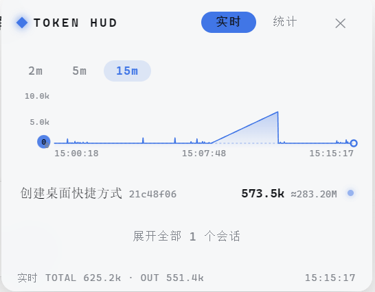

<div align="center">

# dsh-token-panel

[](LICENSE)
[](https://github.com/juhe291/dsh-token-panel/releases)
[](https://github.com/juhe291/dsh-token-panel)
[](https://github.com/topics/dsh-plugin)

**实时 Token 消耗 HUD 插件 —— 为 [DeepSeek Harness](https://github.com/deepseek-ai/deepseek-harness) 提供右下角常驻的 Token 仪表盘：实时会话压力、累计消耗、历史曲线、按日/按月统计，面板跟随当前对话。**

🌐 **中文** ｜ [**English**](README.en.md)

</div>

<p align="center">
  
</p>

---

## 功能总览

右下角一枚迷你胶囊实时显示总 Token 压力，点击展开为可切换的 **实时** / **统计** 双视图仪表盘，配色跟随 DSH 主题（浅色 / 深色自动适配）。面板**跟随当前对话**：切换会话时只显示当前会话；空会话与历史会话默认隐藏，点「展开全部」才显示。

### 🟢 实时视图

| 能力 | 说明 |
|---|---|
| 会话列表 | 每个会话一行：**标题 + 当前上下文压力 + 累计消耗**，标题来自 DSH 会话标题服务 |
| 会话详情 | 点击展开：输入 / 输出 / 缓存读 / 缓存写、压力 / 预计 / 容量、估算成本、上下文占用进度条（>85% 变红） |
| 实时曲线 | 每会话独立 SVG 面积曲线，带时间刻度（HH:MM:SS），支持 **2m / 5m / 15m** 范围切换 |
| 跟随当前会话 | 默认只显示当前打开的对话；历史会话折叠在「展开全部」后面，再多也不挤 |
| 空会话过滤 | 新开但 0 token 的对话完全不显示 |

### 📊 统计视图

| 能力 | 说明 |
|---|---|
| 按日 / 按月 | 独立切换，全部日期 / 月份逐条展示（柱条 + token 数 + 估算成本） |
| 趋势曲线 | 每日 / 每月消耗的 SVG 曲线，刻度显示日期（M/D） |
| 累计消耗 | 顶部汇总：累计 token 总数 + 约 ¥ 估算成本 |
| 持久化 | 数据按天写入磁盘（JSONL），**重启不丢**，越用越完整 |

> ⚠️ **数字口径提示**：统计视图的「按日 / 按月」是**历史累计消耗**（输入 + 输出 + **缓存读**全部累加），缓存读通常是最大头，所以单日就可能上亿 token（显示 M 单位）；而实时视图的数字是**当前上下文压力**（此刻占用的 token，几十万级，显示 k 单位）。**两个数字不是同一个量**，看到「实时 400k / 统计 100M」的差异是正常的，不要担心。
> 会话行上的 `≈` 小字就是该会话的累计消耗，和统计视图口径一致。

### 💰 成本估算

按 **DeepSeek 官方价**（人民币 / 百万 token）分级计价：缓存命中、未命中输入、输出分别计费，仅作展示参考，实际以官网账单为准。

---

## 安装

### 从 GitHub 安装（推荐）

```sh
dsh plugin --profile web add github:juhe291/dsh-token-panel
```

### 从本地路径安装

```sh
dsh plugin --profile web add C:\path\to\dsh-token-panel
```

安装完成后 **重启 profile**，刷新浏览器，右下角出现 TOKEN 胶囊。

> ⚠️ **pnpm ≥ 10 拦截 Git 构建脚本**：首次安装若提示 `ERR_PNPM_GIT_DEP_PREPARE_NOT_ALLOWED`，按提示把报错中的 `allowBuilds` 条目加入 profile 目录下的 `pnpm-workspace.yaml`，然后重跑安装命令。这是 pnpm 的安全机制（Git 依赖需要显式允许执行构建脚本），本包已自带 `prepare` 构建脚本与提交好的 `lib/` 产物，允许后即可正常安装。

---

## 使用说明

1. 点击右下角 **TOKEN 胶囊**（青色呼吸点 + 当前总压力）展开面板
2. 面板头部「**实时 | 统计**」切换视图；「**✕**」收起面板
3. 实时视图：点会话行展开详情与曲线；2m / 5m / 15m 切换曲线窗口
4. 统计视图：「按日 / 按月」切换粒度，柱状列表 + 趋势曲线同屏
5. 会话行主数字 = **当前上下文压力**（现在占着多少）；灰色 `≈` 小字 = **累计消耗**（历史总共用了多少，含缓存读）
6. 面板跟随当前查看的对话；「展开全部」显示历史会话

---

## 配置

配置位于 profile 的 `cordis.patch.yml`（或 `settings.yaml` 的插件分节）：

```yaml
- id: token-panel
  name: dsh-token-panel
  config:
    pollInterval: 1500          # 实时轮询间隔 (ms)
    pricePerMInput: 1           # 未命中输入价格 (CNY / 百万 token)
    pricePerMCacheRead: 0.02    # 缓存命中价格 (CNY / 百万 token)
    pricePerMOutput: 2          # 输出价格 (CNY / 百万 token)
    # dataDir: ~/.dsh/cache/dsh-token-panel   # 持久化目录（可选）
```

| 键 | 默认 | 说明 |
|---|---|---|
| `pollInterval` | `1500` | 浏览器实时轮询间隔（毫秒） |
| `pricePerMInput` | `1` | 每百万未命中输入 token 的估算价格（CNY，仅展示） |
| `pricePerMCacheRead` | `0.02` | 每百万缓存命中 token 的估算价格（CNY，仅展示） |
| `pricePerMOutput` | `2` | 每百万输出 token 的估算价格（CNY，仅展示） |
| `dataDir` | `~/.dsh/cache/dsh-token-panel` | 持久化用量日志目录 |

> 默认价格对应 **deepseek-v4-flash** 当前官方价（缓存命中 ¥0.02 / 未命中 ¥1 / 输出 ¥2，每百万 token）。DeepSeek 自 2026-08-17 起改为峰谷定价（高峰 9-12、14-18 点），价格变动时同步更新上述三项即可。其他模型 / 供应商请按自己的计价调整。

---

## 数据存储

统计日志按天追加写入（每行一条用量增量，JSON）：

```
~/.dsh/cache/dsh-token-panel/
├── usage-2026-08-14.jsonl   # 每日用量日志
└── state.json               # 上次用量基线（重启续接，防重复/防丢失）
```

记录维度：未命中输入、输出、缓存读、缓存写（增量）。首次观察到会话时写入完整基线，之后记录增量——**累计从真实起点算起，重启不丢不重**。

---

## 工作原理

- **Host 面**（`src/index.ts`）：
  - 聚合 `ctx.tokenMeter.measure()`（压力/表面积）+ `ctx.sessionProjections.snapshot()`（provider 实测用量/容量/构成）+ `ctx.sessionTitle.get()`（会话标题）
  - 注册两条 HTTP 路由：`/plugins/dsh-token-panel/snapshot`（实时）、`/plugins/dsh-token-panel/stats`（持久化统计）
  - 用量增量按天持久化（崩溃安全：tmp + rename 原子写）
  - 过滤 0 token 的空会话
- **Client 面**（`src/client/`）：body portal 右下角面板，1.5s 轮询实时数据、10s 轮询统计，SVG 曲线 + 设计令牌配色，**中英文 locale** 跟随 DSH 语言设置，通过 `ctx.sessions.list` 跟踪当前会话

---

## 开发

```sh
pnpm install
pnpm build            # tsc host + tsc client + tsdown
pnpm verify           # 产物一致性检查（exports/patch/client bundle）
```

### 发布新版本

```sh
pnpm build && pnpm verify
git add -A
git commit -m "feat: ..."
git push
```

---

## 常见问题

**Q: 实时数字和统计数字怎么不一样？**
A: 实时显示的是**当前上下文压力**（几十万级，k 单位）；统计显示的是**历史累计消耗**（含缓存读，上亿级，M 单位）。两个指标口径不同，面板已同时展示（压力 + ≈累计）。

**Q: 成本估算准吗？**
A: 按 DeepSeek 官方价分级估算（缓存命中按 ¥0.02/M），仅作参考。权威账单请以 [DeepSeek 官网](https://platform.deepseek.com) 为准。

**Q: 曲线怎么只有最近几分钟？**
A: 实时曲线是滚动内存窗口（600 点 ≈ 15 分钟），重启清零；统计视图的日/月曲线基于磁盘日志，长期保留。

**Q: 面板里有些会话不见了？**
A: 面板跟随当前对话，且隐藏 0 token 的空会话；历史会话点「展开全部」即可看到。

---

## 许可

[MIT](LICENSE)

---

*Made with 🐋 for the DeepSeek Harness plugin ecosystem.*
